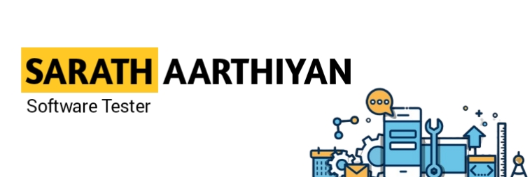

<h1 align="center">Hi 👋, I'm Sarath Aarthiyan</h1>
<h3 align="center">Aspiring Software Test Engineer</h3>

  

- 👉 An Aspiring Associate Software Test Engineer with a passion for crafting clean code and solving puzzles in the digital realm.
- 💻 Currently honing my skills in [My SQL, Manual Testing, API, Selenium and Core Java], I'm on a mission to turn complex problems into elegant solutions.
- 🚀 When I'm not coding, you'll find me exploring the latest tech trends, collaborating on open-source projects and fueling my creativity through [Travelling & Hearing Music].
- 🌟Let's connect and build the future, one line of code at a time! 
- 📫 How to reach me **sarathaarthiyan6@gmail.com**

<h3 align="left">Connect with me:</h3>

<h3 align="left">Languages and Tools:</h3>

        

&nbsp;

<!---
Sarathaarthiyan/Sarathaarthiyan is a ✨ special ✨ repository because its `README.md` (this file) appears on your GitHub profile.
You can click the Preview link to take a look at your changes.
--->
